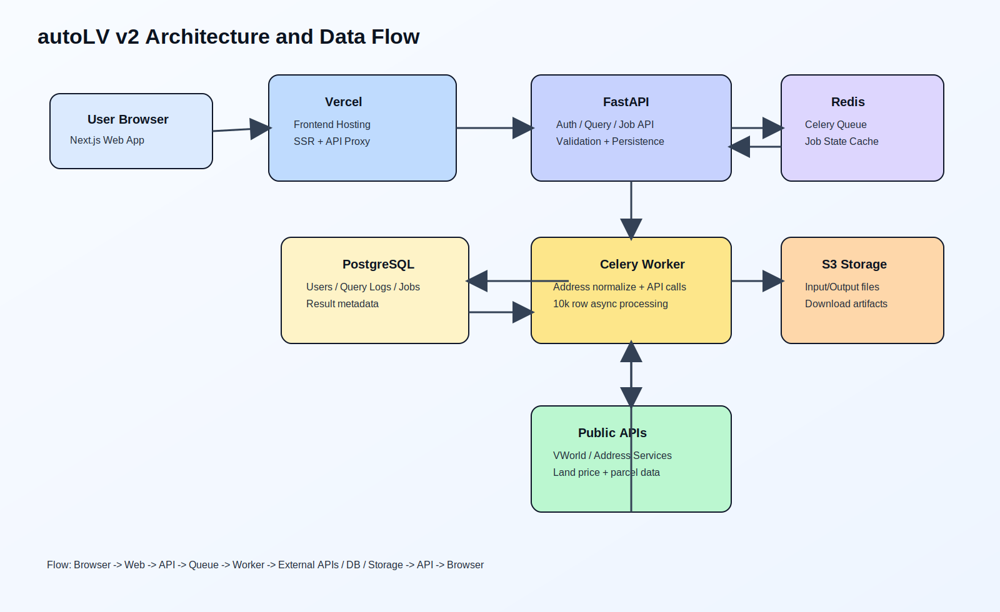

# 시스템 아키텍처 (스택 A)

## 선택한 스택
- 프론트엔드: Next.js 15 + TypeScript + Tailwind + shadcn/ui
- API: FastAPI
- 워커: Celery
- 큐/캐시: Redis
- 데이터베이스: PostgreSQL
- 파일 스토리지: S3 호환 오브젝트 스토리지
- 배포: Vercel(web), Railway(api+worker+redis), Neon(postgres)

## 실행 흐름
1. Web이 조회 또는 업로드 요청을 API로 전송해야 한다.
2. API가 요청을 검증하고 조회/작업 메타데이터를 저장해야 한다.
3. 엑셀 작업은 API가 Redis를 통해 Celery 작업 큐에 등록해야 한다.
4. Worker가 주소를 정규화하고 외부 공공 API를 호출해 행별 결과를 저장해야 한다.
5. Worker가 결과 파일을 오브젝트 스토리지에 업로드하고 작업 상태를 완료로 갱신해야 한다.
6. Web이 작업 상태를 조회하고 완료된 파일을 다운로드해야 한다.

## 다이어그램

