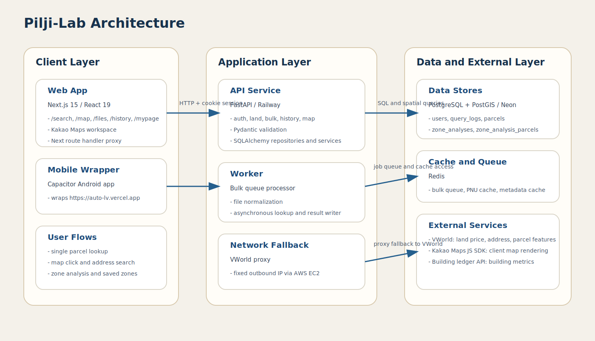

# 시스템 아키텍처

기준일: `2026-03-11`

## 1. 구성 요소
- Web: `apps/web`의 Next.js 애플리케이션
- API: `apps/api`의 FastAPI 애플리케이션
- Mobile: `apps/mobile`의 Capacitor Android wrapper
- Database: PostgreSQL + PostGIS
- Cache/Queue: Redis
- Proxy: `infra/vworld-proxy`

## 2. 런타임 토폴로지
- Vercel
  - 웹 렌더링
  - Next route handler 기반 same-origin VWorld proxy
- Railway
  - API 서버
  - bulk worker 프로세스
  - Redis
- Neon
  - 운영 PostgreSQL
  - PostGIS 확장
- AWS EC2
  - VWorld 고정 IP 우회 프록시

## 3. 주요 데이터 흐름
### 3.1 개별 조회
1. 사용자가 지번 또는 도로명 주소를 입력한다.
2. API가 PNU를 생성하거나 좌표 변환을 수행한다.
3. VWorld 응답을 정규화해 연도별 공시지가와 요약값을 반환한다.
4. 로그인 사용자의 조회는 `query_logs`에 저장된다.

### 3.2 지도 조회
1. 웹이 지도 클릭 좌표나 주소 검색어를 API로 전달한다.
2. API가 좌표를 PNU로 변환하고 `parcels` 캐시를 우선 조회한다.
3. 캐시에 없으면 VWorld를 조회하고 결과를 저장한다.
4. 웹은 공시지가, 증감률, 인근 평균, 토지특성 패널을 렌더링한다.

### 3.3 구역 분석
1. 사용자가 폴리곤을 작성하고 분석을 요청한다.
2. API가 폴리곤 유효성 검사와 면적 제한 검사를 수행한다.
3. VWorld 지적도 피처와 PostGIS 교차 계산으로 포함 후보를 만든다.
4. 포함비율과 점수 기준으로 포함, 경계, 제외를 구분한다.
5. 건축물대장 API와 캐시를 이용해 구역 지표를 계산한다.
6. 사용자가 저장을 선택하면 결과가 `zone_analyses`, `zone_analysis_parcels`에 저장된다.

### 3.4 파일 처리
1. 사용자가 파일을 업로드한다.
2. API가 작업 메타데이터를 저장하고 큐에 넣는다.
3. worker가 헤더 매핑, 주소 정규화, 조회, 결과 파일 생성을 수행한다.
4. 웹은 작업 상태를 폴링하고 완료 시 결과를 다운로드한다.

## 4. 저장 계층
- `users`: 계정 정보
- `email_verifications`: 이메일 인증 수명주기
- `query_logs`: 단건/지도 조회 이력
- `bulk_jobs`: 파일 작업 상태와 결과
- `parcels`: 조회 캐시와 공간 질의 기초 데이터
- `zone_analyses`: 저장한 구역 마스터
- `zone_analysis_parcels`: 구역별 필지 상세
- `building_register_caches`: 건축물대장 캐시
- `zone_ai_feedbacks`: 추천 대비 사용자 최종 결정

## 5. 외부 의존성
- VWorld: 공시지가, 주소, 토지특성, 지적도 피처
- Kakao Maps JS SDK: 지도 렌더링
- 건축물대장 API: 건축 지표 계산
- 도로명 원본 데이터: `apps/api/TN_SPRD_RDNM.txt`
- 법정동 코드: `apps/web/public/ld_codes.json`

## 6. 장애 대응
- VWorld 직접 호출 실패 시 프록시 우회 경로를 시도한다.
- 직접 호출과 프록시 호출 실패 원인을 함께 반환한다.
- `DATABASE_URL`은 배포 환경별 접두어를 정규화해 사용한다.
- 도로명 파일과 법정동 코드 파일은 저장소 기준 경로를 자동 탐색한다.

## 7. 다이어그램

