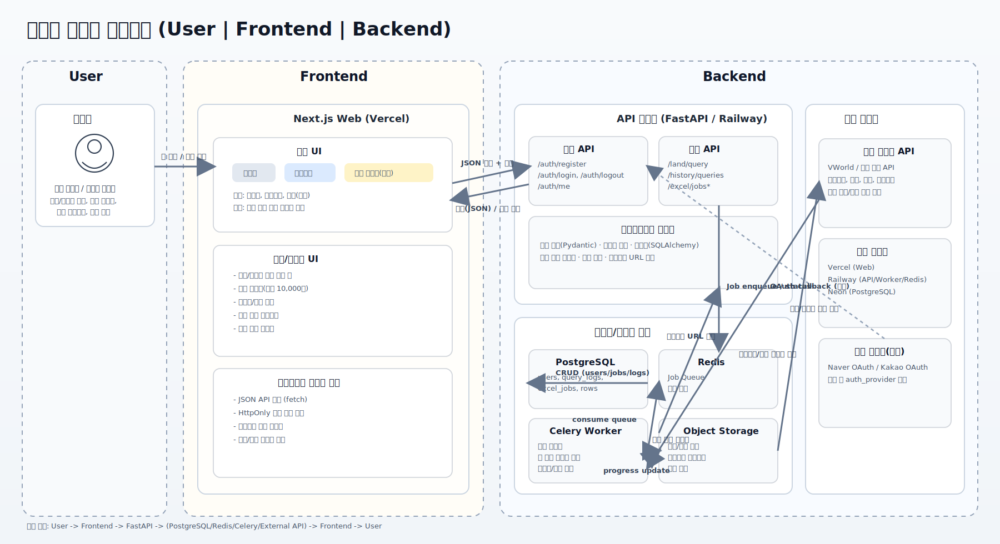

# 시스템 아키텍처

## 1. 현재 아키텍처 (AS-IS)
- Frontend: Next.js 15 (App Router), TypeScript
- Backend: FastAPI
- Database: SQLite (users 테이블 중심)
- External API: VWorld (주소 변환 + 개별공시지가)
- Road Data: `docs/TN_SPRD_RDNM.txt` (도로명 목록 필터링용)

## 2. 주요 데이터 흐름
### 2.1 인증
1. Web -> API `/api/v1/auth/*` 요청
2. API가 사용자 검증 후 쿠키(`access_token`, `refresh_token`) 발급
3. Web은 쿠키 기반으로 로그인 상태를 유지

### 2.2 지번 조회
1. Web이 `ld_code + 산/일반 + 본번/부번` 입력을 API에 전달
2. API가 PNU를 생성
3. API가 VWorld `getIndvdLandPriceAttr` 호출
4. API가 연도별 최신 데이터로 정리해 Web에 반환

### 2.3 도로명 조회
1. Web이 시/도, 시/군/구, 도로명, 건물번호를 API에 전달
2. API가 VWorld 주소 API로 도로명 -> 좌표 -> 지번 변환
3. 변환된 지번으로 PNU 생성 후 개별공시지가 조회
4. API가 표준 형식으로 결과 반환

### 2.4 도로명 리스트
1. Web이 시/도/시군구를 선택하면 API에 자음 목록 요청
2. API가 `TN_SPRD_RDNM.txt`를 읽고 해당 지역에 실제 존재하는 자음만 반환
3. Web이 선택한 자음으로 도로명 목록을 다시 API에서 조회

## 3. 아키텍처 다이어그램
현재 다이어그램은 목표 아키텍처(엑셀 비동기 처리 포함)를 함께 표현한 문서입니다.

## 4. 다음 단계 (TO-BE)
- Celery/Redis 기반 엑셀 비동기 처리
- 서버 DB 기반 조회기록/작업기록 저장
- 결과 파일 스토리지 연동 및 다운로드
- 운영 배포 구성(Vercel + API 호스팅 + 모니터링) 정교화
